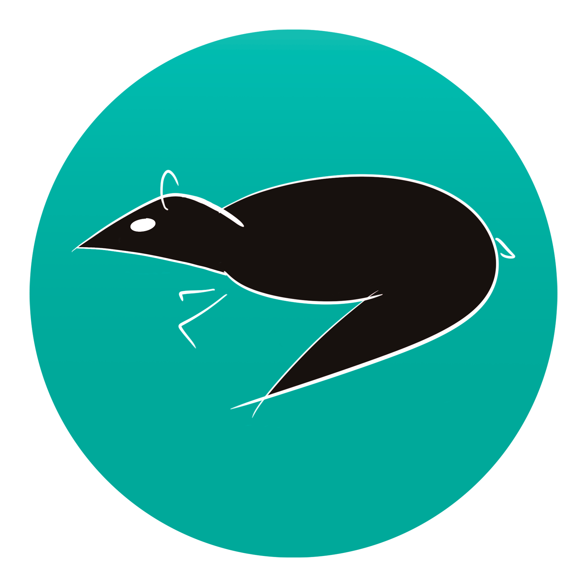

# nahpu 

## Overview

`nahpu` (NAtural History Project Utilities, loosely named after greater Malay chevrotain, *Tragulus napu*) is a cross-platform cataloging app for natural history specimen collection. It leverages mobile revolution to improve specimen recording and data management in the field and beyond. It does not aim to replace museum database, but is targeted to streamline data collection in the field to museum curation. Users can use `nahpu` as a standalone field catalog or to supplement conventional paper-based catalogs.

Documentation:

[EN](https://docs.page/hhandika/nahpu-docs/EN)
[ID](https://docs.page/hhandika/nahpu-docs/ID)

## Development Progress

| Features                        | Progress       |
| ------------------------------- | -------------- |
| Project creation form           | Done           |
| Field narrative form            | Done           |
| Site form                       | Done           |
| Collecting event form           | Done           |
| Mammalian specimen form         | Done           |
| Bird specimen form              | Done           |
| Media management form           | Partially done |
| Project statistics              | Partially done |
| Project expense receipt manager | Partially done |
| Project permit manager          | Partially done |
| CSV export                      | Planned        |
| Json export                     | Planned        |
| Pdf export and printing support | Planned        |
| Zip export                      | planned        |
| Barcode reader                  | Planned        |
| Document scanner                | Planned        |

## Status of the Development

`nahpu` development is at an early stage. First working prototype is targeted for mammalian and avian specimens. We welcome ideas and support for other taxon groups. Feel free to contact the maintainer of this project if you all interested.
